# CodeCollab - Real-Time Collaborative Code Editor (2026)

[](https://codecollab-frontend-1au68sold-rohans-projects-1da2173a.vercel.app/)
[](LICENSE)
[]()

**CodeCollab** is a high-performance, real-time collaborative code editor that allows developers to write, execute, and debug code together in private or public rooms. Built with scalability and low-latency in mind, it features a distributed architecture powered by WebSockets, CRDTs (Yjs), and isolated code execution environments.

---

## 🚀 Live Demo

Access the platform here: **[https://codecollab-frontend-1au68sold-rohans-projects-1da2173a.vercel.app/](https://codecollab-frontend-1au68sold-rohans-projects-1da2173a.vercel.app/)**

Backend URL: **[https://codecollab-backend-private.onrender.com/health](https://codecollab-backend-private.onrender.com/health)**

Compiler's -

C++ : **[https://cpp-executor-y1tt.onrender.com/health](https://cpp-executor-y1tt.onrender.com/health)**

Java : **[https://java-executor-dtnr.onrender.com/health](https://java-executor-dtnr.onrender.com/health)**

NodeJS : **[https://node-executor.onrender.com/health](https://node-executor.onrender.com/health)**

Python : **[https://python-executor-cqlx.onrender.com/health](https://python-executor-cqlx.onrender.com/health)**


**Repository:** [https://github.com/rohanparmar160705/codecollab](https://github.com/rohanparmar160705/codecollab)

---

## 🛠️ Tech Stack

### **Frontend**

- **Framework:** React 18 + Vite (TypeScript)
- **Styling:** Tailwind CSS + Shadcn/UI (Radix Primitives)
- **Editor:** Monaco Editor (VS Code core)
- **Collaboration:** Yjs (CRDT) + Y-Websocket + Y-Monaco
- **State Management:** Redux Toolkit + React Query
- **Deployment:** Vercel

### **Backend**

- **Runtime:** Node.js (Express)
- **Language:** TypeScript
- **Database:** PostgreSQL (via Supabase)
- **ORM:** Prisma
- **Caching & Pub/Sub:** Redis (Upstash)
- **Real-time:** Socket.IO + Custom WebSocket Gateway
- **Deployment:** Render (Dockerized)

### **Code Execution Engine**

- **Architecture:** Isolated Microservices (Executors)
- **Languages:** Python, Java, C++, Node.js
- **Security:** Docker Containers (Isolated Environments)
- **Queueing:** Redis streams for async execution

---

## 🏗️ System Design & Architecture

### 1. Full System Architecture

This diagram illustrates the complete end-to-end flow from the user's browser to the backend services, database, and the isolated code execution environment.

```mermaid
graph TD
    %% Global Graph Settings
    %% linkStyle default interpolate basis

    %% Definitive Colors
    classDef client fill:#e3f2fd,stroke:#1565c0,stroke-width:2px,color:#0d47a1
    classDef backend fill:#fff3e0,stroke:#e65100,stroke-width:2px,color:#e65100
    classDef db fill:#e8f5e9,stroke:#2e7d32,stroke-width:2px,color:#1b5e20
    classDef exec fill:#f3e5f5,stroke:#7b1fa2,stroke-width:2px,color:#4a148c
    classDef gateway fill:#fff9c4,stroke:#fbc02d,stroke-width:2px,color:#f57f17

    %% ---------------------------------------------------------
    %% 1. CLIENT LAYER
    %% ---------------------------------------------------------
    subgraph Client_Layer ["💻 Client Side"]
        direction TB
        User([👤 User / Developer])
        Frontend[⚛️ React SPA + Monaco Editor]
    end

    %% ---------------------------------------------------------
    %% 2. BACKEND INFRASTRUCTURE
    %% ---------------------------------------------------------
    subgraph Backend_Cloud ["☁️ Backend Infrastructure (Render)"]
        direction TB

        Gateway[🛡️ API Gateway]

        subgraph Services ["🔥 Microservices"]
            direction TB
            Auth[🔐 Auth Service]
            ExecController[⚡ Execution Controller]
            Collab[🤝 Collab & Room Service]
        end

        subgraph Data ["💾 Data Persistence"]
            direction TB
            Redis[(🚀 Redis Pub/Sub)]
            Postgres[(🐘 PostgreSQL DB)]
        end
    end

    %% ---------------------------------------------------------
    %% 3. EXECUTION CLOUD
    %% ---------------------------------------------------------
    subgraph Execution_Cloud ["⚙️ Execution Engine (Isolated Containers)"]
        direction TB
        LangRouter[🔀 Language Router]

        subgraph Runners ["🏃 Runtime Environments"]
            direction LR
            Cpp[C++ Runner]
            Java[Java Runner]
            Node[Node.js Runner]
            Py[Python Runner]
        end
    end

    %% =========================================================
    %% RELATIONS & FLOWS
    %% =========================================================

    %% Client -> Backend
    User <==>|HTTPS / WSS| Frontend
    Frontend <==>|REST / Socket.io| Gateway

    %% Gateway -> Services
    Gateway ==> Auth
    Gateway ==> Collab
    Gateway ==> ExecController

    %% Service -> Data
    Auth --> Postgres
    Collab -->|Real-Time Sync| Redis
    Redis -.->|"Periodic Backup 1h"| Postgres

    %% Execution Flow
    ExecController ==>|HTTP POST Code| LangRouter
    LangRouter --> Cpp
    LangRouter --> Java
    LangRouter --> Node
    LangRouter --> Py

    %% Return Paths (Implicit or explicitly dotted)
    Cpp -.->|"Result (JSON)"| ExecController
    Java -.->|"Result (JSON)"| ExecController
    Node -.->|"Result (JSON)"| ExecController
    Py -.->|"Result (JSON)"| ExecController

    %% Apply Styles
    class User,Frontend client
    class Auth,ExecController,Collab backend
    class Redis,Postgres db
    class LangRouter,Cpp,Java,Node,Py exec
    class Gateway gateway
```

```mermaid
graph TD
    %% Styling
    classDef node fill:#eceff1,stroke:#37474f,stroke-width:1px;
    classDef highlight fill:#fff9c4,stroke:#fbc02d,stroke-width:2px;

    User([👤 User]) -->|HTTPS| CDN[🌍 Vercel CDN]
    User -->|WSS| Gateway[🛡️ WebSocket Gateway]

    subgraph Frontend ["🖥️ Frontend"]
        CDN --> ReactApp[React App]
    end

    subgraph Backend ["☁️ Backend Services"]
        direction TB
        Gateway --> Auth[🔐 Auth Service]
        Gateway --> Collab[🤝 Collab & Room Service]

        Collab -->|Hot Data| Redis[(🚀 Redis Cache)]
        Redis -.->|Persist| DB[(🐘 PostgreSQL)]
        Auth --> DB
    end

    subgraph Execution ["⚡ Execution Engine"]
        Gateway -->|POST| Router[🔀 Language Router]
        Router --> Py[🐍 Python]
        Router --> Java[☕ Java]
        Router --> Node[🟢 Node.js]
        Router --> Cpp[⚙️ C++]
    end

    class Gateway,Redis highlight
```





### 3. Real-Time Collaboration (Yjs & CRDTs)

We use **Yjs** (a Conflict-free Replicated Data Type) to ensure eventual consistency across all connected clients. Changes are broadcasted via a central WebSocket gateway and persisted periodically.

```mermaid
sequenceDiagram
    autonumber

    actor UserA as 👤 User A (Editor)
    actor UserB as 👤 User B (Viewer)
    participant WS as 🛡️ Gateway
    participant Redis as 🚀 Redis Pub/Sub
    participant DB as 🐘 Database

    Note over UserA, UserB: 🟢 Real-Time Collaboration Session

    UserA->>UserA: Type "console.log('Hi')"
    UserA->>WS: Send binary update (Yjs)

    WS->>Redis: Publish to 'room:123'
    Redis-->>WS: Broadcast to Subscribers

    WS-->>UserB: Push Update
    UserB->>UserB: Merge changes (CRDT)

    rect rgb(240, 248, 255)
        Note right of Redis: 💾 Buffered Persistence
        WS->>Redis: Cache Update
        Redis--)DB: Flush to DB (Every 1h)
    end
```



### 4. Secure Code Execution Flow

Code execution requests are routed to language-specific runners. Each runner executes the code in an isolated environment with resource limits (CPU, RAM, Time).

```mermaid
flowchart LR
    %% Styles
    classDef request fill:#e3f2fd,stroke:#2196f3,stroke-width:2px
    classDef router fill:#fff3e0,stroke:#ff9800,stroke-width:2px
    classDef container fill:#f3e5f5,stroke:#9c27b0,stroke-width:2px
    classDef result fill:#e8f5e9,stroke:#4caf50,stroke-width:2px

    Req(📝 Client Request) -->|1. Code + Input| API[🛡️ API Gateway]
    API -->|2. Route| Router{🔀 Lang Router}

    subgraph Runners ["⚙️ Isolated Runners"]
        direction TB
        Router -->|Python| Py[🐍 Python]
        Router -->|Java| Java[☕ Java]
        Router -->|C++| Cpp[⚙️ C++]
        Router -->|Node| Node[🟢 Node.js]
    end

    Py & Java & Cpp & Node -->|3. Stdout/Stderr| Out(📄 Result Output)
    Out -->|4. JSON Response| API
    API -->|5. Return| Req

    class Req request
    class Router router
    class Py,Java,Cpp,Node container
    class Out result
```



### 5. Database Schema (Simplified)


---

## ✨ Key Features

- **Real-time Collaboration:**
  - Sub-millisecond latency using binary Yjs updates.
  - Live cursor tracking and user presence.
  - Conflict-free editing (no override issues).
- **Room Management:**
  - **Private Rooms:** Invite-only secure spaces.
  - **Public Rooms:** Open for anyone to view/join via link.
  - **Role-Based Access:** Owner, Editor, Viewer permissions.
- **Integrated Compiler:**
  - Run code instantly in 4 supported languages.
  - Standard Input (stdin) support for interactive programs.
  - Secure execution sandbox.
- **Authentication:**
  - Secure JWT-based auth with refresh token rotation.
  - Persistent user profiles.

---

## 🏁 Getting Started (Docker)

The easiest way to run the full stack (Frontend, Backend, Executors, Redis) is via Docker Compose.

### Prerequisites

- Docker & Docker Compose
- PostgreSQL (running locally or remote)

### Steps

1. **Clone the repository**

   ```bash
   git clone https://github.com/rohanparmar160705/codecollab.git
   cd codecollab
   ```

2. **Configure Environment**

   - **Backend**: Create `.env` in `codecollab-backend-private` (copy `.env.example`).
     ```bash
     cp codecollab-backend-private/.env.example codecollab-backend-private/.env
     ```
     _Ensure `DATABASE_URL` points to your PostgreSQL instance._

3. **Start Application**

   ```bash
   docker-compose up --build
   ```

   This will start:

   - **Frontend**: [http://localhost:5173](http://localhost:5173)
   - **Backend**: [http://localhost:4000](http://localhost:4000)
   - **Redis**: Port 6379
   - **Executors**: Python, Java, C++, Node.js (Ports 5001-5004)

### Manual Setup (Development)

<details>
<summary>Click to verify manual setup instructions</summary>

#### 1. Backend Setup

```bash
cd codecollab-backend-private
npm install
cp .env.example .env
npm run prisma:generate
npm run prisma:migrate
npm run dev
```

#### 2. Frontend Setup

```bash
cd codecollab-frontend-private
npm install
npm run dev
```

</details>

---

## © 2026 CodeCollab. Created by Rohan Parmar.
